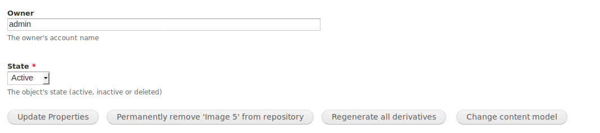

# Islandora Change Content Model

## Introduction

This module provides the ability for a user to change an object's content model, retaining all of its existing properties and datastreams. The only thing that changes is the `hasModel` relationship in the object's RELS-EXT datastream. Using this module to change a content model does not validate the existence of datastreams required by the new content model, does not remove any datastreams from the object, and does not check to see if the new content model is allowed in the object's parent collection. _The user is responsible for all these tasks_, although third-party modules can implement hooks to perform them.

Even though changing the content model of most objects has no unintended impact after its derivatives have been regenerated (but see the note about collection and compound objects below), changing a content model should be an uncommon event. The intended purpose of this module is to avoid deleting an object and replacing it with one of a different content model, for example, when you want to retain the object's PID. You should use this module with caution. Since the RELS-EXT is a datastream, other modules that implement hooks listening for changes to the RELS-EXT datastream may initiate processes that have unpredictable or unwanted effects.

## Requirements

* [Islandora](https://github.com/Islandora/islandora)

## Installation

Same as any Drupal module.

## Configuration

You will need to select which content models objects must have in order to be eligible to have their models changed, at `admin/islandora/tools/change_cmodel`.

In order to access the user interface for changing an object's content model, users must have the "Change Islandora Content Models" permission provided by this module, plus the following permissions provided by the core Islandora module:

* Manage object properties
* Add datastreams to repository objects
* Regenerate derivatives
* Replace datastreams

## Usage

Sufficiently privileged users will see a fourth button, "Change content model", in each object's "Manage > Properties" subtab:

Clicking on this button will reveal a form where the user chooses the new content model. After choosing the new content model, the user is presented with a confirmation message suggesting what to do next, e.g.:

> Content model changed to _islandora:sp_large_image_cmodel_. You should replace this object's OBJ datastream, if necessary, and regenerate its derivatives.

The standard workflow for using this module is:

1. Use the "Change content model" button to change an object's content model as described above.
1. If necessary, replace the OBJ with a file that is consistent with the new content model. This is an important step since the OBJ determines what derivatives are regenerated. For example, if you change a Basic Image object to a Large Image object, you should replace the `.png` OBJ with a `.tif` OBJ.
1. Regenerate derivatives for the object using Islandora's standard tools.
1. If desired, delete any datastreams that are irrelevant to the new content model.

## Changing the content model of objects that have children or members

One of the unintended impacts that will occur if you change the content model of an object that has children or members (for example, objects with compound or collection content models), is that the way the parent behaves in relation to the children will change. For example, changing the content model of a collection object will break the collection's browse list. Its children are not orphaned, since their RELS-EXTs still contain the relationship with their former parent, but the Basic Collection Solution Pack no longer treats the parent as a collection object and produce a browse list using those relationships. Changing the content model of the parent back to Islandora Collection Content Model will restore the collection browse list. In general, an object's content model can be changed back to its original with no side effects, but if you regenerate derivatives after changing an object's content model, you will need to manually replace (or revert) the OBJ and regenerate derivatives again.

It would be wise to prepare a collection's members _prior_ to changing the content model of the parent collection object by migrating the members to another collection first. That way, the member objects' RELS-EXTs will contain only the relationship with the new collection. Migrating them via Islandora's user interface will remove the relationship with the collection object whose content model is subsequently being changed.

## Extending/customizing this module

See the `islandora_change_cmodel.api.php` file for hooks this module defines.

## Maintainer

* [Mark Jordan](https://github.com/mjordan)

## Development and feedback

Use cases, suggestions, and bug reports, as well as pull requests, are welcome. Please see CONTRIBUTING.md for more information.

## License

* [GPLv3](http://www.gnu.org/licenses/gpl-3.0.txt)
